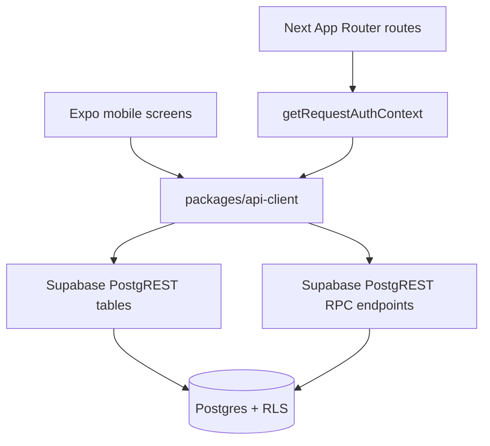

# API and Database

See [[Sackerl Code Map]], [[Authentication and Household]], [[Receipt Pipeline]], [[Stock and Expiry]], [[Recipes and Shopping]], and [[Shared UI]]. Supabase Auth plus Supabase/Postgres is the current provider boundary.

## Runtime boundaries

| Caller          | Boundary                                                                 | Current behavior                                                                                                                                                                                                                        |
| --------------- | ------------------------------------------------------------------------ | --------------------------------------------------------------------------------------------------------------------------------------------------------------------------------------------------------------------------------------- |
| Mobile          | `apps/mobile` → shared client → Supabase REST                            | Direct authenticated PostgREST CRUD for profile, household, zones, stock, receipts, recipes, and shopping lists. See [`items.ts`](../../packages/api-client/src/items.ts) and [`profile.ts`](../../packages/api-client/src/profile.ts). |
| Web             | Next route → `getRequestAuthContext` → shared client → Supabase REST/RPC | Route handlers validate the bearer token through Supabase Auth, resolve household membership, then return JSON. See [`api-auth.ts`](../../apps/web/lib/api-auth.ts).                                                                    |
| Review commands | Either client → `/rest/v1/rpc/*` → Postgres function                     | SCKRL-310 review reads and writes are server-owned RPCs, not direct table mutations. See [`requestRpcJson`](../../packages/api-client/src/receipts.ts).                                                                                 |

Direct PostgREST CRUD is appropriate for ordinary resource operations: `SackerlItemsClient.listItems/createItem/updateItem/deleteItem`, `SackerlProfileClient.getMe/ensureMe/updateMe`, `SackerlShoppingListClient.listItems/createItem/updateItem/deleteItem`, `SackerlReceiptsClient.createReceipt/listReceipts/getReceipt/updateReceipt`, and recipe reads. Receipt review uses the new commands `get_receipt_review`, `promote_receipt_parse`, `mark_receipt_parse_failed`, and `save_receipt_review`; their client methods are `getReceiptReview`, `promoteReceiptParse`, `markReceiptParseFailed`, and `saveReceiptReview`.

## HTTP route surface

| Area     | Routes                                                                                                                      | Implementation                                                                                                 |
| -------- | --------------------------------------------------------------------------------------------------------------------------- | -------------------------------------------------------------------------------------------------------------- |
| Identity | `GET/PATCH /me`, `GET/PATCH /household`                                                                                     | [`me/route.ts`](../../apps/web/app/me/route.ts), [`household/route.ts`](../../apps/web/app/household/route.ts) |
| Stock    | `GET/POST /items`, `POST /items/batch`, `PATCH/DELETE /items/:id`, `GET /items/removal-stats`                               | [`apps/web/app/items`](../../apps/web/app/items/route.ts)                                                      |
| Receipts | `GET/POST /receipts`, `POST /receipts/:id/parse`, `GET/PUT /receipts/:id/items`                                             | [`apps/web/app/receipts`](../../apps/web/app/receipts/route.ts)                                                |
| Recipes  | `GET /suggestions`                                                                                                          | [`suggestions/route.ts`](../../apps/web/app/suggestions/route.ts)                                              |
| Shopping | `GET/POST /shopping-list`, `POST /shopping-list/batch`, `PATCH/DELETE /shopping-list/:id`, `GET /shopping-list/suggestions` | [`apps/web/app/shopping-list`](../../apps/web/app/shopping-list/route.ts)                                      |

## Persistence map

| Migration                                                                                                                        | Durable boundary                                                                                                     |
| -------------------------------------------------------------------------------------------------------------------------------- | -------------------------------------------------------------------------------------------------------------------- |
| [`20260524211500_sckrl_009_profile_households.sql`](../../supabase/migrations/20260524211500_sckrl_009_profile_households.sql)   | `users`, `households`, `household_members`, auth-user profile trigger, and user/owner RLS policies.                  |
| [`20260531110000_sckrl_102_household_zones.sql`](../../supabase/migrations/20260531110000_sckrl_102_household_zones.sql)         | Adds `households.zones` as a non-empty `text[]` with default fridge, pantry, basement, and freezer values.           |
| [`20260531203000_sckrl_201_item_data_model.sql`](../../supabase/migrations/20260531203000_sckrl_201_item_data_model.sql)         | Adds global `categories`, normalized `zones`, zone sync helpers/triggers, `items`, membership helper, and stock RLS. |
| [SCKRL-415 removal outcomes](../../supabase/migrations/20260607100000_sckrl_415_item_removal_outcomes.sql)                       | Adds used/composted removal reason metadata to stock items.                                                          |
| [SCKRL-501 recipes](../../supabase/migrations/20260611100000_sckrl_501_recipes.sql)                                              | Global recipe records, seed recipes and read policies.                                                               |
| [SCKRL-511 shopping lists](../../supabase/migrations/20260612100000_sckrl_511_shopping_list.sql)                                 | Household shopping-list rows, source/quantity data and RLS.                                                          |
| [Shopping-list idempotency](../../supabase/migrations/20260621100000_sckrl_511_shopping_list_idempotency.sql)                    | Unique active recipe-sourced entries for retry-safe batch insertion.                                                 |
| [`20260621110000_sckrl_302_receipts.sql`](../../supabase/migrations/20260621110000_sckrl_302_receipts.sql)                       | `receipts`, receipt status enum, timestamps, indexes, household RLS.                                                 |
| [`20260804100000_sckrl_303_receipt_parsing.sql`](../../supabase/migrations/20260804100000_sckrl_303_receipt_parsing.sql)         | `receipt_items`, parsed metadata, confidence, receipt-item RLS.                                                      |
| [`20260911110000_sckrl_310_receipt_review_data.sql`](../../supabase/migrations/20260911110000_sckrl_310_receipt_review_data.sql) | Parse generations, review enums/columns, legacy backfill, grants, four RPC commands.                                 |

Stock, receipt, zone, and shopping-list rows carry `household_id` and use household-membership checks where their migrations define them. `users`, `households`, and `household_members` use user/owner policies; categories and recipes are not universally household-scoped. The SCKRL-310 migration revokes authenticated direct insert/update/delete access for review-owned rows and exposes authenticated reads plus bounded receipt header writes. The migration is present locally but has not been applied to dev Supabase; deploy it before using the new review RPCs against that environment.

The database is the source of truth for atomicity and conflict handling. TypeScript maps snake_case rows to camelCase models and computes UI-ready effective values in [`mapReceiptItemRow`](../../packages/api-client/src/receipts.ts), while SQL functions return one receipt-plus-items snapshot.

Use [[Method Index]] for every exported method and [[Maintenance]] when a route, client contract, migration, RLS policy, or RPC changes.
