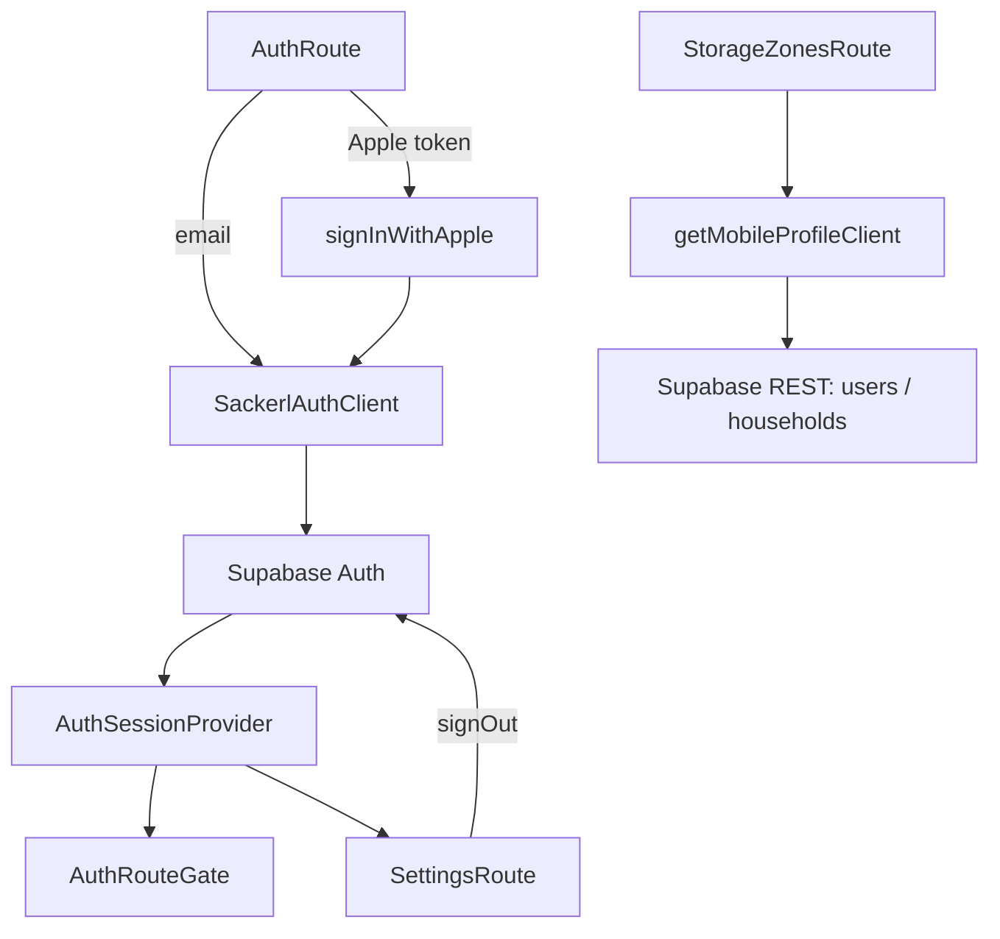

---
tags:
  - code-map
  - mobile
  - authentication
  - household
---

# Authentication and Household

Authentication has two layers. The mobile adapter creates one Supabase auth client with AsyncStorage persistence; the session provider loads the session once, subscribes to auth changes, and exposes `session`, `client`, `signOut`, and `refreshSession`. Source: [apps/mobile/lib/auth.ts](../../apps/mobile/lib/auth.ts), and [apps/mobile/lib/auth-session.tsx](../../apps/mobile/lib/auth-session.tsx).

`AuthRoute` switches among `signIn`, `signUp`, and `reset`. `handleEmailSubmit` delegates to `sendPasswordReset`, `signUpWithEmail`, or `signInWithEmail`; `handleAppleSignIn` delegates to `signInWithApple`. Source: [apps/mobile/app/auth.tsx](../../apps/mobile/app/auth.tsx). The shared client validates URL and anon key, creates a persistent `GoTrueClient`, and wraps email, Apple identity-token, reset, session, auth-state, and sign-out methods. Source: [packages/api-client/src/auth.ts](../../packages/api-client/src/auth.ts).

The storage-zone screen starts with four selected defaults, toggles built-in zones, slugifies custom names, and requires at least one selection. `handleContinue` sends signed-in users through `ensureHousehold` and `updateHouseholdZones`; signed-out users are pushed to auth with `returnTo: '/storage-zones'`. Source: [apps/mobile/app/storage-zones.tsx](../../apps/mobile/app/storage-zones.tsx).

| Method or component | Source | Called by / calls |
| --- | --- | --- |
| `getMobileAuthClient` | [apps/mobile/lib/auth.ts](../../apps/mobile/lib/auth.ts) | `AuthSessionProvider` calls it; calls `createSackerlAuthClient` with AsyncStorage. |
| `signInWithApple` | [apps/mobile/lib/auth.ts](../../apps/mobile/lib/auth.ts) | `AuthRoute.handleAppleSignIn` calls it; calls Apple Authentication and `signInWithAppleIdentityToken`. |
| `AuthSessionProvider` | [apps/mobile/lib/auth-session.tsx](../../apps/mobile/lib/auth-session.tsx) | `RootLayout` calls it; calls `getSession`, `onAuthStateChange`, `signOut`. |
| `SackerlProfileClient.getHousehold` | [packages/api-client/src/profile.ts](../../packages/api-client/src/profile.ts) | Mobile Home, Stock, Expiring, Suggestions, Recipe, Scan, and Shopping List call it; reads `households`. |
| `SackerlProfileClient.ensureHousehold` | [packages/api-client/src/profile.ts](../../packages/api-client/src/profile.ts) | Storage Zones, Add Item, and Stock edits call it; calls `getHousehold`, `ensureMe`, and creates membership. |
| `SackerlProfileClient.updateHouseholdZones` | [packages/api-client/src/profile.ts](../../packages/api-client/src/profile.ts) | `StorageZonesRoute.handleContinue` calls it; patches household `zones`. |
| `SettingsRoute` | [apps/mobile/app/(tabs)/settings.tsx](../../apps/mobile/app/(tabs)/settings.tsx) | Tab router calls it; calls provider `signOut`. |

The household is the lookup boundary passed to stock, recipe, shopping-list, and receipt clients. There is no true authenticated web product shell in this mobile-oriented implementation; the web app currently supplies API routes and design pages rather than the equivalent signed-in product navigation. Follow [[Mobile Navigation]], [[Receipt Pipeline]], [[API and Database]], [[Sackerl Code Map]], [[Method Index]], and [[Maintenance]].
