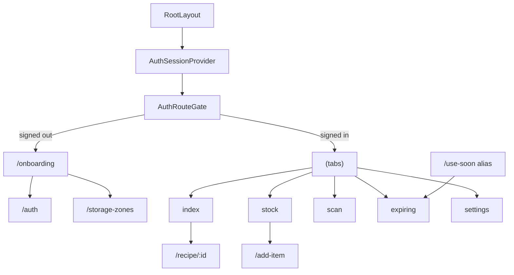

---
tags:
  - code-map
  - mobile
  - navigation
---

# Mobile Navigation

The mobile app is an Expo Router stack. `RootLayout` mounts `AuthSessionProvider`, the null-rendering `AuthRouteGate`, and a headerless stack. The stack names the onboarding, auth, storage-zone, item, recipe, suggestion, shopping-list, use-soon, and tab routes. Source: [apps/mobile/app/_layout.tsx](../../apps/mobile/app/_layout.tsx).

`AuthRouteGate` reads `useSegments`, `useLocalSearchParams`, and `useAuthSession`. While loading it does nothing; a signed-out user is replaced with onboarding for protected routes, while a signed-in user is sent to `/` or back to `/storage-zones` when `returnTo` requests it. Source: [apps/mobile/lib/auth-session.tsx](../../apps/mobile/lib/auth-session.tsx).

The tab layout defines five entries in `tabs`: Home, Stock, Scan, Expiring, and Settings. `SackerlTabBar` renders the custom bar, navigates with `navigation.navigate`, and returns `null` while Scan is active so the capture screen can occupy the viewport. Source: [apps/mobile/app/(tabs)/_layout.tsx](../../apps/mobile/app/(tabs)/_layout.tsx).

| Method or component | Source | Called by / calls |
| --- | --- | --- |
| `RootLayout` | [apps/mobile/app/_layout.tsx](../../apps/mobile/app/_layout.tsx) | Expo Router calls it; mounts `AuthSessionProvider` and `AuthRouteGate`. |
| `AuthRouteGate` | [apps/mobile/lib/auth-session.tsx](../../apps/mobile/lib/auth-session.tsx) | `RootLayout` calls it; calls `useAuthSession`, `router.replace`. |
| `TabsLayout` | [apps/mobile/app/(tabs)/_layout.tsx](../../apps/mobile/app/(tabs)/_layout.tsx) | Root stack calls it; supplies `SackerlTabBar`. |
| `SackerlTabBar` | [apps/mobile/app/(tabs)/_layout.tsx](../../apps/mobile/app/(tabs)/_layout.tsx) | `TabsLayout` calls it; calls `navigation.navigate`. |
| `HomeRoute` | [apps/mobile/app/(tabs)/index.tsx](../../apps/mobile/app/(tabs)/index.tsx) | Tab router calls it; calls profile, items, and recipes clients. |
| `StockRoute` | [apps/mobile/app/(tabs)/stock.tsx](../../apps/mobile/app/(tabs)/stock.tsx) | Tab router calls it; calls profile and items clients. |
| `ExpiringRoute` | [apps/mobile/app/(tabs)/expiring.tsx](../../apps/mobile/app/(tabs)/expiring.tsx) | Tab router and `use-soon` call it; calls profile and items clients. |

The onboarding buttons push to `/storage-zones` or `/auth`; the storage-zone flow can return to auth and then continue. `use-soon.tsx` is a direct re-export of the Expiring route. Source: [apps/mobile/app/onboarding.tsx](../../apps/mobile/app/onboarding.tsx), and [apps/mobile/app/use-soon.tsx](../../apps/mobile/app/use-soon.tsx).

Current boundary: the tab shell and redirects are real mobile behavior, while search and notification affordances on Home have no route or client call yet. For the shared contracts, follow [[Authentication and Household]], [[Stock and Expiry]], [[Recipes and Shopping]], [[Sackerl Code Map]], [[API and Database]], [[Method Index]], and [[Maintenance]]. Receipt entry is traced in [[Receipt Pipeline]].
