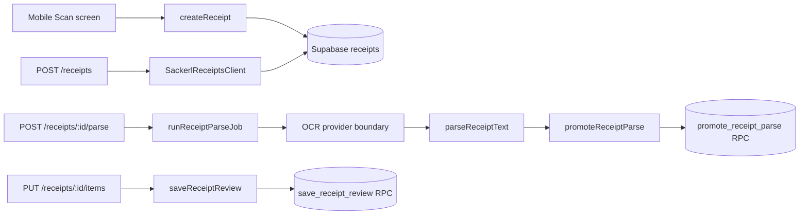

# Receipt Pipeline

See [[Sackerl Code Map]], [[Mobile Navigation]], [[Authentication and Household]], [[Stock and Expiry]], and [[Maintenance]]. This note follows the implemented receipt path through SCKRL-302, SCKRL-303, and the locally accepted SCKRL-310 review contract.

## User-flow map

| Stage                    | Current caller           | Key methods and source                                                                                                                                                                                                                                                  |
| ------------------------ | ------------------------ | ----------------------------------------------------------------------------------------------------------------------------------------------------------------------------------------------------------------------------------------------------------------------- |
| Capture shell            | Mobile `ScanRoute`       | [`createUploadedReceipt`](<../../apps/mobile/app/(tabs)/scan.tsx>), [`getMobileReceiptsClient`](../../apps/mobile/lib/receipts.ts)                                                                                                                                      |
| Receipt row              | Mobile or web            | [`createReceipt`](../../packages/api-client/src/receipts.ts), `GET/POST /receipts` ([route](../../apps/web/app/receipts/route.ts))                                                                                                                                      |
| Parse                    | Web route only           | `POST /receipts/:id/parse` ([route](../../apps/web/app/receipts/[id]/parse/route.ts)), [`runReceiptParseJob`](../../apps/web/lib/receipt-parsing.ts)                                                                                                                    |
| Deterministic parsing    | Server/shared package    | [`parseReceiptText`](../../packages/api-client/src/receipt-parsing.ts), [`confidenceLevelForScore`](../../packages/api-client/src/receipt-parsing.ts)                                                                                                                   |
| Atomic promotion         | Shared client → Postgres | [`promoteReceiptParse`](../../packages/api-client/src/receipts.ts), `promote_receipt_parse` ([migration](../../supabase/migrations/20260911110000_sckrl_310_receipt_review_data.sql))                                                                                   |
| Review snapshot          | Web route/client         | [`getReceiptReview`](../../packages/api-client/src/receipts.ts), `GET /receipts/:id/items` ([route](../../apps/web/app/receipts/[id]/items/route.ts))                                                                                                                   |
| Corrections/manual lines | Web route → RPC          | [`saveReceiptReview`](../../packages/api-client/src/receipts.ts), `PUT /receipts/:id/items` ([route](../../apps/web/app/receipts/[id]/items/route.ts)), `save_receipt_review` ([migration](../../supabase/migrations/20260911110000_sckrl_310_receipt_review_data.sql)) |

## What actually runs

The mobile scan screen still renders the camera-style shell. Capture, Gallery, and PDF actions call `createUploadedReceipt`, wait briefly, and create a receipt with a synthetic `sackerl://receipt/{source}/{timestamp}` URL. No camera, gallery, PDF binary upload, private media storage, or mobile receipt review screen is implemented. The successful message says the row is ready for parsing; mobile does not start the parse job.

The web parse route loads the receipt, resolves `OCR_PROVIDER`, extracts text, parses it, rejects an empty item result, and calls `promoteReceiptParse` with the receipt's expected generation and revision. The default deterministic provider accepts an explicit text override or the synthetic mobile URL. Mindee and Vision provider names currently return `501`; other values are rejected. On failure, `markReceiptParseFailed` conditionally marks only an unpromoted receipt as failed and preserves the original parse error.

SCKRL-310 keeps parser evidence (`inferred*`, raw text, confidence, parser version) separate from review values (`corrected*`, `included`, `reviewState`). Promotion creates a new generation atomically; review saves require the active generation, expected revision, every existing line exactly once, and stable `clientLineId` values for manual lines. Reprocessing after a saved review is rejected until an explicit reset/merge contract exists. Placement into stock and expiry assignment are future work; follow [[Stock and Expiry]].

## Source boundaries

- `apps/mobile` owns navigation and capture-shell state; it calls shared clients directly.
- `apps/web` owns HTTP authentication, household lookup, payload parsing, provider orchestration, and JSON error mapping.
- `packages/api-client` owns validation, row mapping, direct PostgREST requests, RPC calls, and review summaries.
- `supabase/migrations` owns transaction boundaries, RLS/grants, optimistic conflict checks, and durable history.

The generated root inventory is the canonical method catalogue; use [[Method Index]] for the complete list instead of expanding this note.
