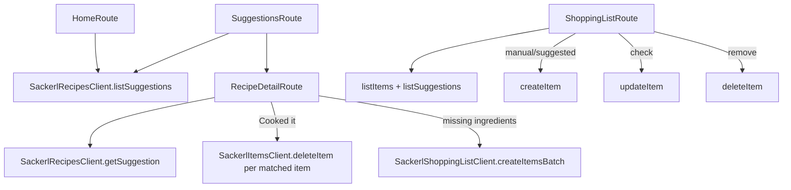

---
tags:
  - code-map
  - mobile
  - recipes
  - shopping
---

# Recipes and Shopping

Home asks for one recipe suggestion alongside item counts, seven-day expiry rows, zones, and per-zone counts. Suggestions loads up to 50 household-scored recipes and filters them locally by `recipeMatchesSuggestionFilter`. A card navigates to `/recipe/[id]`; the save-heart control is rendered disabled. Sources: [apps/mobile/app/(tabs)/index.tsx](../../apps/mobile/app/(tabs)/index.tsx), and [apps/mobile/app/suggestions.tsx](../../apps/mobile/app/suggestions.tsx).

`SackerlRecipesClient.listSuggestions` reads all recipes and active household stock, including `expires_on`. It captures one calendar day per request, then passes it to `scoreRecipeAgainstStock`. The scorer excludes past, missing and invalid dates before ingredient matching; today's date remains eligible. The list requires positive coverage even with `minScore: 0`, then filters by minimum score, sorts, and limits. `getSuggestion` uses the same eligibility rule; an existing recipe can return zero coverage and no matched item IDs. Source: [packages/api-client/src/recipes.ts](../../packages/api-client/src/recipes.ts).

Both [mobile](../../apps/mobile/lib/recipes.ts) and [web](../../apps/web/lib/recipes.ts) explicitly configure `Europe/Vienna` for the Austrian pilot. The shared client requires a time zone and accepts an injectable clock; household-specific time zones remain future work. SCKRL-506 uses the existing date only: it neither distinguishes printed dates from estimates nor certifies food safety. SCKRL-406/407 own that provenance and warning UI.

Recipe detail loads the household and one suggestion on focus. `handleCookedIt` calls `deleteItem` once for every matched stock item, then resets the local suggestion. `handleAddMissingToShoppingList` sends missing ingredients to the shopping-list client as a batch. Source: [apps/mobile/app/recipe/[id].tsx](../../apps/mobile/app/recipe/[id].tsx).

Shopping List loads active list rows and receipt-history suggestions in parallel. Manual entry uses source `manual`; a receipt suggestion uses source `suggested`; check/uncheck calls `updateItem`; remove calls `deleteItem`. Source: [apps/mobile/app/shopping-list.tsx](../../apps/mobile/app/shopping-list.tsx). The client filters archived rows by default, deduplicates recipe batches, and exposes item, batch, update, delete, and suggestion methods. Source: [packages/api-client/src/shopping-list.ts](../../packages/api-client/src/shopping-list.ts).

| Method or component | Source | Called by / calls |
| --- | --- | --- |
| `SackerlRecipesClient.listSuggestions` | [packages/api-client/src/recipes.ts](../../packages/api-client/src/recipes.ts) | Home and Suggestions call it; calls `scoreRecipeAgainstStock`. |
| `SackerlRecipesClient.getSuggestion` | [packages/api-client/src/recipes.ts](../../packages/api-client/src/recipes.ts) | `RecipeDetailRoute` calls it; scores one recipe against active stock. |
| `scoreRecipeAgainstStock` | [packages/api-client/src/recipes.ts](../../packages/api-client/src/recipes.ts) | Recipe client calls it with an explicit day; excludes ineligible dates before returning coverage/matched IDs and missing ingredients. |
| `SackerlShoppingListClient.listItems` | [packages/api-client/src/shopping-list.ts](../../packages/api-client/src/shopping-list.ts) | Shopping List calls it; reads active/archived rows. |
| `SackerlShoppingListClient.createItem` | [packages/api-client/src/shopping-list.ts](../../packages/api-client/src/shopping-list.ts) | Shopping List manual/suggestion actions call it. |
| `SackerlShoppingListClient.createItemsBatch` | [packages/api-client/src/shopping-list.ts](../../packages/api-client/src/shopping-list.ts) | Recipe detail uses it for missing ingredients. |
| `SackerlShoppingListClient.updateItem` / `deleteItem` | [packages/api-client/src/shopping-list.ts](../../packages/api-client/src/shopping-list.ts) | Shopping List toggle/remove handlers call them. |

Current behavior gap: “Cooked it” removes every matched stock item for the recipe, so a matched lot is consumed as a whole item and there is no quantity decrement or partial-lot choice. The recipe save control is also intentionally disabled in the current screen. Follow [[Stock and Expiry]], [[Authentication and Household]], [[Receipt Pipeline]], [[API and Database]], [[Sackerl Code Map]], [[Method Index]], and [[Maintenance]].
