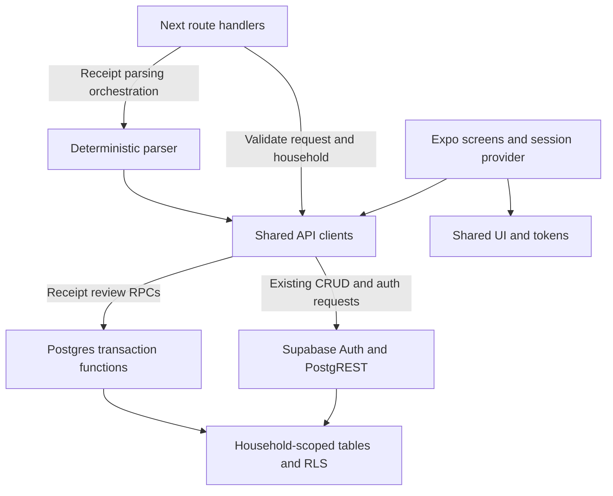

# Sackerl Code Map

Start here when you want to understand a change without reading the whole repository.
This map describes the checked-out implementation, including local SCKRL-310 receipt review
contracts. It is an explanation of code, not a claim that every feature is deployed or complete.

## Follow a user action

| What you want to understand                              | Start with                                               |
| -------------------------------------------------------- | -------------------------------------------------------- |
| How the app opens, chooses a screen and maintains login  | [[Mobile Navigation]] → [[Authentication and Household]] |
| Adding, moving, editing or removing groceries            | [[Stock and Expiry]]                                     |
| Scanning, parsing and correcting a receipt               | [[Receipt Pipeline]]                                     |
| Recipe suggestions, recipe completion and shopping lists | [[Recipes and Shopping]]                                 |
| Where data goes and which layer checks access            | [[API and Database]]                                     |
| Shared components, styles and native/web variants        | [[Shared UI]]                                            |
| Which checks cover a change                              | [[Testing and Delivery]]                                 |
| Where a method lives, calls and is called                | [[Method Index]]                                         |
| Keeping this map accurate after an AI change             | [[Maintenance]]                                          |

## The main code boundaries

The mobile app currently calls shared Supabase clients directly for most data actions. The Next
API provides another authenticated entry point; it is **not** an obligatory hop for every mobile
request. Receipt review uses new database transactions. The mobile review/placement screens and
real media/OCR pipeline are still pending, so the diagram does not imply a complete mobile
receipt-to-stock journey. See [[Receipt Pipeline]] for the exact stopping point.

## Find the right file before making a change

1. Open the relevant flow note above. Its method table links to the implementation files.
2. Find the method in [[Method Index]] and open its generated module note.
3. Read **Used by** to see affected callers and **Calls / references** to see dependencies.
4. Follow the source link; the accompanying line number is from the last index refresh.
5. Use [[Testing and Delivery]] to choose evidence and [[Maintenance]] to update the explanation.

For example, a change to receipt saving affects
`PUT /receipts/:id/items` → `readSaveReceiptReviewBody` →
`SackerlReceiptsClient.saveReceiptReview` → SQL `save_receipt_review`.
The receipt flow note explains _why_ those layers exist; the generated notes show individual
calls and callers. A UI gesture or framework route can invoke a method without appearing as a
normal TypeScript call, so an empty caller list never proves that a method is unused.

## Use it in Obsidian

Open the repository folder as a vault, or use your existing vault if it already contains the
repository. Open this note under `docs/code-map`. No Obsidian plugin is required: these are plain
Markdown notes with wikilinks and Mermaid diagrams. Source links assume the map stays in the repo.

- For a manageable overview, open **Graph view** and search `tag:#code-map -tag:#generated`.
- For code dependencies, open a generated module and use **Local graph**, depth 1–2.
- **Backlinks** answer “which notes/modules refer to this?” The explicit Used by lists show
  individual statically resolved methods.
- Search a symbol such as `saveReceiptReview`, `handleSave`, or `is_household_member` to find its
  generated entry. Common handler names include their enclosing component in the index.

Without Obsidian, start with these ordinary links:
[mobile navigation](Mobile%20Navigation.md), [receipts](Receipt%20Pipeline.md),
[API/database](API%20and%20Database.md), [method index](Method%20Index.md),
[maintenance](Maintenance.md). Wikilinks are intended for Obsidian and may appear as text in other
Markdown viewers.

## Product truth stays separate

[status.md](../../status.md) records ticket progress; [features.md](../../features.md) records
accepted scope; [ADR-0001](../architecture/adr-0001-reliable-food-loop.md) records the receipt
architecture decisions. This map should help you inspect those claims against code. It does not
replace them, and a checked-in migration is not evidence that a database has applied it.
