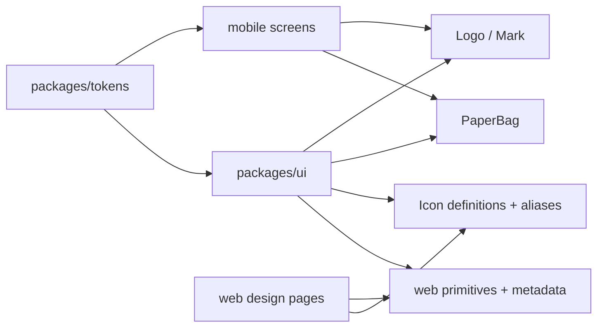

---
tags:
  - code-map
  - shared-ui
  - mobile
---

# Shared UI

The shared UI package exports icons, Logo/Mark, PaperBag, web primitives, and category/zone metadata. Its barrel is [packages/ui/src/index.ts](../../packages/ui/src/index.ts). Mobile imports the platform-resolved `Logo` and `PaperBag`; the same package also supplies web-oriented `Button`, `Chip`, `Card`, `Eyebrow`, `Avatar`, `RoundIconButton`, `Tile`, `Zone`, and `ListRow`.

`packages/tokens` is the visual source for colors, spacing, radii, fonts, typography, and native typography. Source: [packages/tokens/src/index.ts](../../packages/tokens/src/index.ts). Mobile screens select `nativeTypography` by platform and use `colors`/`space` directly; this is why screen styles remain close to their route components.

`Icon` resolves aliases through `resolveIconName`, maps path/circle/rect primitives, and supports decorative or titled accessibility output. The native tab bar reads the same definitions and draws them with `react-native-svg`. Sources: [packages/ui/src/icons.tsx](../../packages/ui/src/icons.tsx), and [apps/mobile/app/(tabs)/_layout.tsx](../../apps/mobile/app/(tabs)/_layout.tsx).

`Logo` composes `Mark` and the “sackerl” wordmark for React Native. `PaperBag` resolves configured items, observes reduce-motion, and runs native animated loops unless motion is reduced. Sources: [packages/ui/src/logo.native.tsx](../../packages/ui/src/logo.native.tsx), and [packages/ui/src/paper-bag.native.tsx](../../packages/ui/src/paper-bag.native.tsx).

| Method or component | Source | Called by / calls |
| --- | --- | --- |
| `ScreenScaffold` | [apps/mobile/components/ScreenScaffold.tsx](../../apps/mobile/components/ScreenScaffold.tsx) | Its test mounts it; calls `Logo` and optional `PaperBag`. |
| `Logo` / `Mark` | [packages/ui/src/logo.native.tsx](../../packages/ui/src/logo.native.tsx) | Auth, onboarding, storage zones, settings, and scaffold call `Logo`; `Logo` calls `Mark`. |
| `PaperBag` | [packages/ui/src/paper-bag.native.tsx](../../packages/ui/src/paper-bag.native.tsx) | Onboarding, Home, storage zones, and scaffold call it; calls `NativePaperBagItem`. |
| `resolveIconName` / `Icon` | [packages/ui/src/icons.tsx](../../packages/ui/src/icons.tsx) | Web primitives and web pages call them; `Icon` renders `iconDefinitions`. |
| `Button`, `Chip`, `Card`, `ListRow` | [packages/ui/src/primitives.tsx](../../packages/ui/src/primitives.tsx) | Web design pages call them; `Button` and `RoundIconButton` call `Icon`. |
| `categoryMeta` / `zoneMeta` | [packages/ui/src/primitives.tsx](../../packages/ui/src/primitives.tsx) | Web primitives and mobile screens read metadata for labels, colors, and short codes. |

The mobile product screens currently use React Native `Pressable`, `View`, and local SVG components extensively, so shared web primitives are not a universal mobile component layer. `ScreenScaffold` is a reusable native shell, but the product routes mostly define their own layout. Follow [[Mobile Navigation]], [[Authentication and Household]], [[Stock and Expiry]], [[Recipes and Shopping]], [[Receipt Pipeline]], [[Sackerl Code Map]], [[API and Database]], [[Method Index]], and [[Maintenance]].
