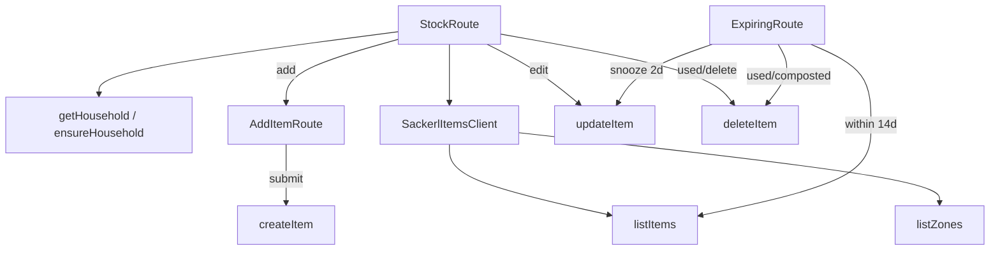

---
tags:
  - code-map
  - mobile
  - stock
  - expiry
---

# Stock and Expiry

Stock is a zone-first list. `StockRoute` normalizes the `zone` search parameter, loads household zones and paged items on focus, filters by category in memory, and separates `isUseSoonItem` rows from the rest. Selecting a row opens an edit sheet; saving can rename, recategorize, move, change quantity, and set or estimate an expiry. Source: [apps/mobile/app/(tabs)/stock.tsx](../../apps/mobile/app/(tabs)/stock.tsx).

`AddItemRoute` obtains writable zones, validates name, positive quantity, zone, and optional `YYYY-MM-DD`, then calls `ensureHousehold` and `createItem`. If expiry is blank it sends `estimateExpiryDate` through the client input path. Source: [apps/mobile/app/add-item.tsx](../../apps/mobile/app/add-item.tsx). The shared estimator is category-and-zone based and returns a date from `estimateExpiryDays`/`estimateExpiryDate`. Source: [packages/api-client/src/items.ts](../../packages/api-client/src/items.ts).

The Expiring route loads `expiresWithinDays: 14` across pages, joins zone labels, groups rows into Today, Tomorrow, This week, and Next week, then offers Used, Compost, and Snooze 2d. Used and composted call `deleteItem` with removal metadata. Snooze calls `updateItem` with a date two days after the current expiry and removes the row when it leaves the 14-day window. Source: [apps/mobile/app/(tabs)/expiring.tsx](../../apps/mobile/app/(tabs)/expiring.tsx).

| Method or component | Source | Called by / calls |
| --- | --- | --- |
| `SackerlItemsClient.listZones` | [packages/api-client/src/items.ts](../../packages/api-client/src/items.ts) | Stock, Add Item, and Expiring call it; reads `zones`. |
| `SackerlItemsClient.listItems` | [packages/api-client/src/items.ts](../../packages/api-client/src/items.ts) | Home, Stock, and Expiring call it; filters household, zone, category, expiry, and removed state. |
| `SackerlItemsClient.createItem` | [packages/api-client/src/items.ts](../../packages/api-client/src/items.ts) | `AddItemRoute.handleSubmit` calls it; prepares and inserts one row. |
| `SackerlItemsClient.updateItem` | [packages/api-client/src/items.ts](../../packages/api-client/src/items.ts) | Stock edit and Expiring snooze call it; patches item fields including `expires_on`. |
| `SackerlItemsClient.deleteItem` | [packages/api-client/src/items.ts](../../packages/api-client/src/items.ts) | Stock removal, Expiring actions, and Recipe cooking call it; delegates to `updateItem`. |
| `estimateExpiryDate` | [packages/api-client/src/items.ts](../../packages/api-client/src/items.ts) | Add Item and Stock edit use it for blank expiry input. |

Current behavior gap: snoozing changes the stored `expires_on` date itself, so the original date and the fact that the user snoozed it are not retained by this flow. Removal is a soft update with `removed_on` and an optional `removal_reason`. Follow [[Authentication and Household]], [[Receipt Pipeline]], [[API and Database]], [[Sackerl Code Map]], [[Method Index]], and [[Maintenance]].
