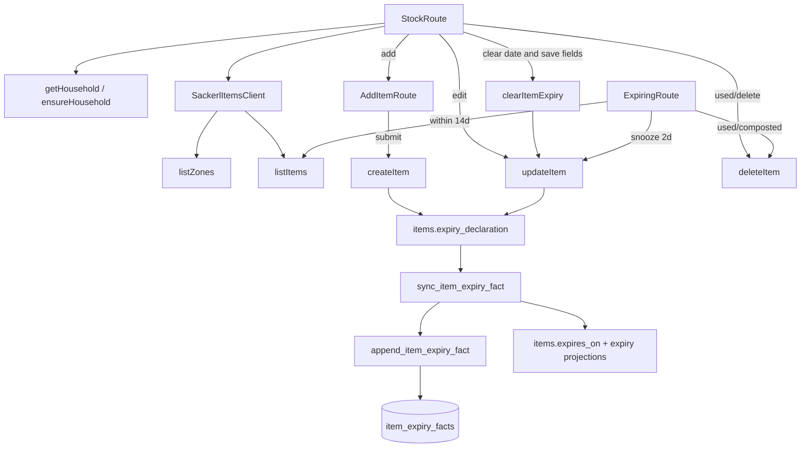

---
tags:
  - code-map
  - mobile
  - stock
  - expiry
---

# Stock and Expiry

Stock is a zone-first list. `StockRoute` normalizes the `zone` search parameter, loads household zones and paged items on focus, filters by category in memory, and separates `isUseSoonItem` rows from the rest. Selecting a row opens an edit sheet; saving can rename, recategorize, move, change quantity, explicitly set or clear an expiry. Untouched expiry is omitted from the mutation. Source: [apps/mobile/app/(tabs)/stock.tsx](<../../apps/mobile/app/(tabs)/stock.tsx>).

```mermaid
flowchart TD
  Stock[StockRoute] --> Profile[getHousehold / ensureHousehold]
  Stock --> Items[SackerlItemsClient]
  Items --> Zones[listZones]
  Items --> List[listItems]
  Stock -->|add| Add[AddItemRoute]
  Add -->|submit| Create[createItem]
  Stock -->|edit| Update[updateItem]
  Stock -->|clear date and save fields| Clear[clearItemExpiry]
  Clear --> Update
  Create --> Declaration[items.expiry_declaration]
  Update --> Declaration
  Declaration --> Trigger[sync_item_expiry_fact]
  Trigger --> Facts[append_item_expiry_fact]
  Facts --> History[(item_expiry_facts)]
  Trigger --> Projection[items.expires_on + expiry projections]
  Stock -->|used/delete| Remove[deleteItem]
  Expiring[ExpiringRoute] -->|within 14d| List
  Expiring -->|used/composted| Remove
  Expiring -->|snooze 2d| Update
```

`AddItemRoute` obtains writable zones, validates name, positive quantity, zone, and optional `YYYY-MM-DD`, then calls `ensureHousehold` and `createItem`. An untouched or blank-fallback date uses `estimateExpiryForHousehold` and records a declared, unconfirmed estimate; a typed date records a confirmed user assertion. Source: [apps/mobile/app/add-item.tsx](../../apps/mobile/app/add-item.tsx). The shared estimator is category-and-zone based and returns a date from `estimateExpiryDays`/`estimateExpiryDate`. Source: [packages/api-client/src/items.ts](../../packages/api-client/src/items.ts).

The Expiring route loads `expiresWithinDays: 14` across pages, joins zone labels, groups rows into Today, Tomorrow, This week, and Next week, then offers Used, Compost, and Snooze 2d. Used and composted call `deleteItem` with removal metadata. Snooze calls `updateItem` with a date two days after the current expiry and removes the row when it leaves the 14-day window. Source: [apps/mobile/app/(tabs)/expiring.tsx](<../../apps/mobile/app/(tabs)/expiring.tsx>).

| Method or component                        | Source                                                                     | Called by / calls                                                                                                                                    |
| ------------------------------------------ | -------------------------------------------------------------------------- | ---------------------------------------------------------------------------------------------------------------------------------------------------- |
| `SackerlItemsClient.listZones`             | [packages/api-client/src/items.ts](../../packages/api-client/src/items.ts) | Stock, Add Item, and Expiring call it; reads `zones`.                                                                                                |
| `SackerlItemsClient.listItems`             | [packages/api-client/src/items.ts](../../packages/api-client/src/items.ts) | Home, Stock, and Expiring call it; filters household, zone, category, expiry, and removed state.                                                     |
| `SackerlItemsClient.createItem`            | [packages/api-client/src/items.ts](../../packages/api-client/src/items.ts) | `AddItemRoute.handleSubmit` calls it; prepares and inserts one row.                                                                                  |
| `SackerlItemsClient.updateItem`            | [packages/api-client/src/items.ts](../../packages/api-client/src/items.ts) | Stock edit and Expiring snooze call it; patches item fields including `expires_on`.                                                                  |
| `SackerlItemsClient.deleteItem`            | [packages/api-client/src/items.ts](../../packages/api-client/src/items.ts) | Stock removal, Expiring actions, and Recipe cooking call it; delegates to `updateItem`.                                                              |
| `estimateExpiryDate`                       | [packages/api-client/src/items.ts](../../packages/api-client/src/items.ts) | Add's household-calendar helper supplies its base day; Stock Edit never replaces a blank with an estimate.                                           |
| `SackerlItemsClient.confirmItemExpiry`     | [packages/api-client/src/items.ts](../../packages/api-client/src/items.ts) | Available client helper; reads and guards the active fact. Unknown-origin dates become user assertions; declared sources are preserved.              |
| `SackerlItemsClient.clearItemExpiry`       | [packages/api-client/src/items.ts](../../packages/api-client/src/items.ts) | Stock Edit uses it for an explicit clear, combining other item changes and the rendered fact expectation in one PATCH.                               |
| `SackerlItemsClient.listItemExpiryHistory` | [packages/api-client/src/items.ts](../../packages/api-client/src/items.ts) | SCKRL-406 backend slice; reads `item_expiry_facts` newest first under RLS.                                                                           |
| `isUnconfirmedExpiryEstimate`              | [packages/api-client/src/items.ts](../../packages/api-client/src/items.ts) | The state SCKRL-407 marks as uncertain: `source = 'estimated'`, `origin = 'declared'`, with no confirmation. Unknown legacy origins remain distinct. |

## Expiry provenance (SCKRL-406)

`items.expires_on` is still the displayed date. A date change or new declaration appends an immutable evidence row
to `item_expiry_facts` recording source, printed marking, confidence, estimator version, actor,
confirmation time and the superseded fact. A caller states provenance with the write-only
`items.expiry_declaration` command column, which a `before insert or update` trigger consumes and
always stores as `null`; an undeclared write records the weakest honest provenance
(`origin = 'inferred'`, `source = 'estimated'`, unconfirmed) instead of claiming one. Five read-only
projection columns on `items` mirror the active fact, so `listItems` still needs one query, and
`StockItem.expiryProvenance` exposes them. Contract:
[docs/features/sckrl-406-expiry-provenance.md](../features/sckrl-406-expiry-provenance.md).
Migration: [supabase/migrations/20260916100000_sckrl_406_expiry_provenance.sql](../../supabase/migrations/20260916100000_sckrl_406_expiry_provenance.sql).

No value in this model asserts that food is safe. Mobile Add/Edit now declares expiry intent.
Edit sends the rendered fact ID, including null for no prior fact, and preserves the draft on
conflict. Unrelated edits omit expiry. The migration remains unapplied; this describes local code,
not verified hosted behavior. Warning UI remains SCKRL-407.

Current behavior gap: snoozing changes the stored `expires_on` date itself, so the original date and the fact that the user snoozed it are not retained by this flow. SCKRL-406 now makes that visible in history rather than fixing it; SCKRL-408 owns separating snooze from expiry, and a snooze must never write an expiry fact. Removal is a soft update with `removed_on` and an optional `removal_reason`, and leaves provenance untouched. Follow [[Authentication and Household]], [[Receipt Pipeline]], [[API and Database]], [[Sackerl Code Map]], [[Method Index]], and [[Maintenance]].
