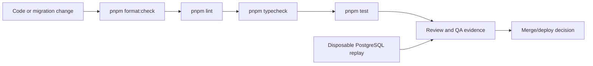

# Testing and Delivery

See [[Sackerl Code Map]], [[Receipt Pipeline]], [[API and Database]], [[Mobile Navigation]], [[Shared UI]], [[Method Index]], and [[Maintenance]]. This is the repeatable local verification map, not a claim of hosted, device, or provider coverage.

## Commands and ownership

| Check            | Command                                                                  | What it covers                                                                     |
| ---------------- | ------------------------------------------------------------------------ | ---------------------------------------------------------------------------------- |
| Formatting       | `pnpm format:check`                                                      | Prettier-managed source and selected docs.                                         |
| Lint             | `pnpm lint`                                                              | Turbo runs each workspace ESLint configuration.                                    |
| Types            | `pnpm typecheck`                                                         | Shared package, web, and mobile TypeScript contracts.                              |
| Tests            | `pnpm test`                                                              | Turbo builds dependencies first, then runs package, web, and mobile Vitest suites. |
| Production build | `pnpm build`                                                             | Workspace builds; useful before release and after Next route changes.              |
| Focused package  | `pnpm --filter @sackerl/api-client test`                                 | Shared client and parser tests.                                                    |
| Focused apps     | `pnpm --filter @sackerl/web test` / `pnpm --filter @sackerl/mobile test` | Route/parser tests or deterministic mobile component behavior.                     |

The CI workflow ([`.github/workflows/ci.yml`](../../.github/workflows/ci.yml)) runs frozen install, format check, lint, typecheck, and test on pushes to `main`/`dev` and pull requests. It does not apply migrations, start Supabase, run a device, or configure OCR providers.

## Current test map

| Layer             | Representative coverage                                                                                                                                                                                                  |
| ----------------- | ------------------------------------------------------------------------------------------------------------------------------------------------------------------------------------------------------------------------ |
| Shared API client | Auth, profile, items, receipts/review RPC payloads, receipt parser, recipes, shopping list ([tests](../../packages/api-client/src/receipts.test.ts)).                                                                    |
| Web               | Household auth/route behavior, receipt parse orchestration, review payload validation, `GET/PUT /receipts/:id/items` ([test](../../apps/web/app/receipts/[id]/items/route.test.ts)).                                     |
| Mobile            | Add-item normalization and mounted `ScreenScaffold` behavior; Scan remains a visual shell with simulated receipt persistence.                                                                                            |
| Database          | SCKRL-310 migration replay, legacy preservation, command conflicts, snapshot consistency, manual-line provenance, immutable parser evidence, and denied direct mutations ([SQL README](../../supabase/tests/README.md)). |

## SCKRL-310 evidence

The local acceptance recorded in `status.md` is 102 automated tests, workspace format/lint/typecheck, Next production build, clean and populated PostgreSQL replay, legacy assertions, and review/adversarial SQL command suites. SQL fixtures use a disposable database, synthetic rows, an `auth.uid()` stub, and Supabase-like grants. Command fixtures roll back their own writes; never point them at hosted or application data.

The SCKRL-310 migration is not applied to dev Supabase. No hosted Supabase/Auth/PostgREST, real camera/gallery/PDF, private media upload, asynchronous OCR provider, mobile review UI, stock placement, expiry placement, or deployed CI run is covered by those local checks. SCKRL-310 review data is therefore a ready local contract, not a completed end-user receipt loop.

## Maintenance workflow

1. Start with the changed source and its caller. Update the matching table, diagram, and source link in this folder.
2. For client, route, RPC, migration, RLS, or provider changes, update both [[Receipt Pipeline]] and [[API and Database]].
3. For commands, fixtures, CI, or acceptance evidence, update this note and the ticket/status handoff.
4. Keep method-level detail in the generated [[Method Index]]; add only the key methods needed to explain a flow here.
5. Run the narrowest focused check first, then the root checks required by CI. Record unrun hosted/device/provider checks as limits.

The durable maintenance owner and handoff policy are in [[Maintenance]]. Do not put credentials, tokens, user data, or temporary runtime notes in code-map notes.
